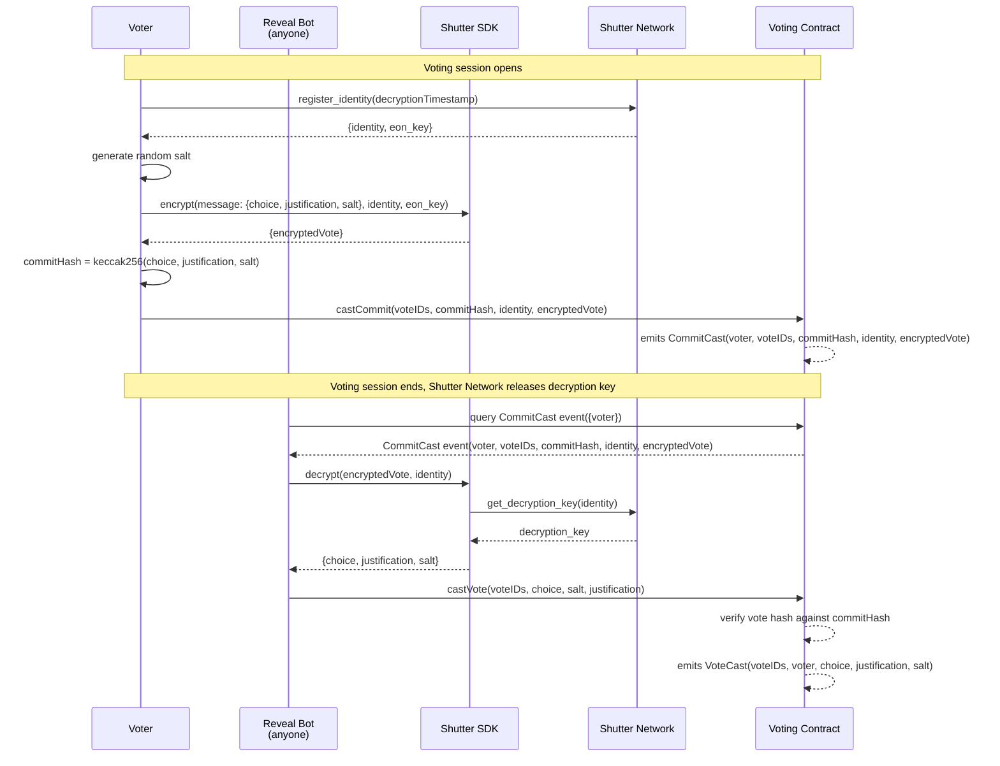

# Shutter Shielded Onchain Voting

This code demonstrates a proof-of-concept for a shielded onchain voting system using [the Shutter API](https://github.com/shutter-network/shutter-api), a threshold encryption service by [Shutter Network](https://www.shutter.network).

Credits to @whwgeorge for the protocol which does not require a trusted oracle during the vote reveal step. 

Automation of the reveal step improves UX compared to typical 2-steps commitment/reveal protocols without additional trust assumption beyond Shutter Network.

## Overview

The voting process consists of two steps: commitment and reveal.



### 1. Vote commitment
A message is encrypted offchain by the Shutter Network consisting of the vote choice, the justification and a random salt. The Shutter network is instructed to release the decryption key at a later time once the voting session is over (after 10 seconds [for this example](https://github.com/kleros/shutter-shielded-voting/blob/cf721ed7558bcf8c17fc701b66ad1bf315da0519/scripts/shutter.ts#L7)).

The vote commitment is cast onchain by the voter and consists of the salted hash of the vote choice and a justification.

The vote remains hidden until the decryption key is released by the Shutter Network.

To enable later decryption, the Shutter identity and encrypted vote are [emitted as part of `CommitCast` event](./contracts/ShutterShieldedVoting.sol#L68).

### 2. Vote reveal

After the voting session is over, anyone may retrieve the decrypted message from the Shutter Network using the identity and encrypted vote emitted earlier.

Anyone in possession of the vote, justification and salt from the decrypted message may cast the vote onchain and effectively reveal it. 

The contract computes the salted hash of the vote choice and a justification and compares it to the commitment. If they match, the vote is counted.

The vote is emitted as part of `VoteCast` event.

### Demo

[](https://asciinema.org/a/tUtdH9pZLEACPkVlx34GZYPJq)

### Implementation

- Voting contract: [ShutterShieldedVoting.sol](./contracts/ShutterShieldedVoting.sol)
- Voting commitment and reveal bot: [shutterAutoVote.ts](./scripts/shutterAutoVote.ts)
- Shutter API wrapper: [shutter.ts](./scripts/shutter.ts)

### Integration into a voting application

Typically the vote commitment step is performed by the user via a voting web application.

The vote reveal step is performed by a bot continuously watching for `CommitCast` events and submitting the vote onchain once the decryption key is released. Anyone watcher may participate in this step.

## Getting started

### Setup

```bash
yarn install
yarn compile
```

### Execution

#### Shell 1: local node

```bash
yarn local-node
```

#### Shell 2: voting

```bash
yarn deploy
yarn auto-vote
```

#### Running again
The contract supports only a single voting session for simplicity so it must be redeployed. Simply stop the local node and re-run the above steps.


